# FinTrack Pro — Plan Completo del Proyecto

---

## 1. Descripción del Proyecto

FinTrack Pro es una aplicación web de gestión de finanzas personales. Permite registrar ingresos, gastos, categorías financieras y metas de ahorro. Consume una API REST propia y almacena datos en PostgreSQL (Supabase). Ofrece dashboards interactivos con estadísticas y gráficos financieros.

---

## 2. Objetivos

### Objetivo General

Desarrollar una aplicación web fullstack para gestionar finanzas personales con arquitectura cliente-servidor.

### Objetivos Específicos

- Registrar y categorizar ingresos y gastos
- Administrar categorías financieras personalizadas
- Gestionar metas de ahorro con seguimiento de progreso
- Visualizar estadísticas financieras mediante gráficos interactivos
- Consultar reportes y filtrar por período, categoría y tipo
- Consumir API REST con validación y manejo de errores
- Persistir datos en PostgreSQL (Supabase) con Row Level Security
- Desplegar la aplicación en Vercel

---

## 3. Stack Tecnológico

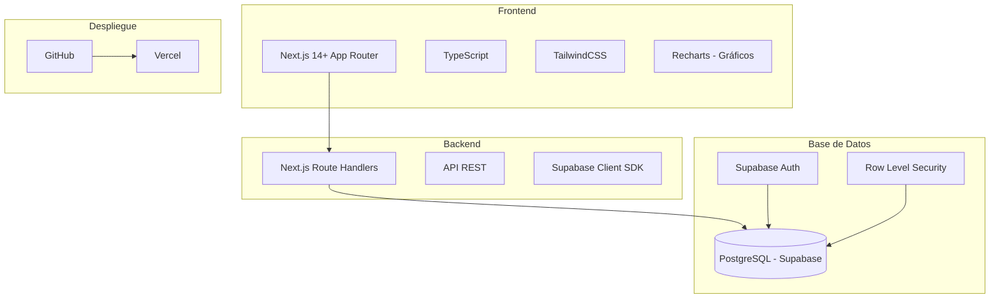

| Capa | Tecnología |
|------|-----------|
| Frontend | Next.js 14+ (App Router), TypeScript, TailwindCSS |
| Gráficos | Recharts |
| Backend/API | Next.js Route Handlers (API REST) |
| Base de Datos | PostgreSQL (Supabase) |
| Autenticación | Supabase Auth (email/password) |
| Despliegue | Vercel |
| Control de Versiones | Git + GitHub |

---

## 4. Actores del Sistema

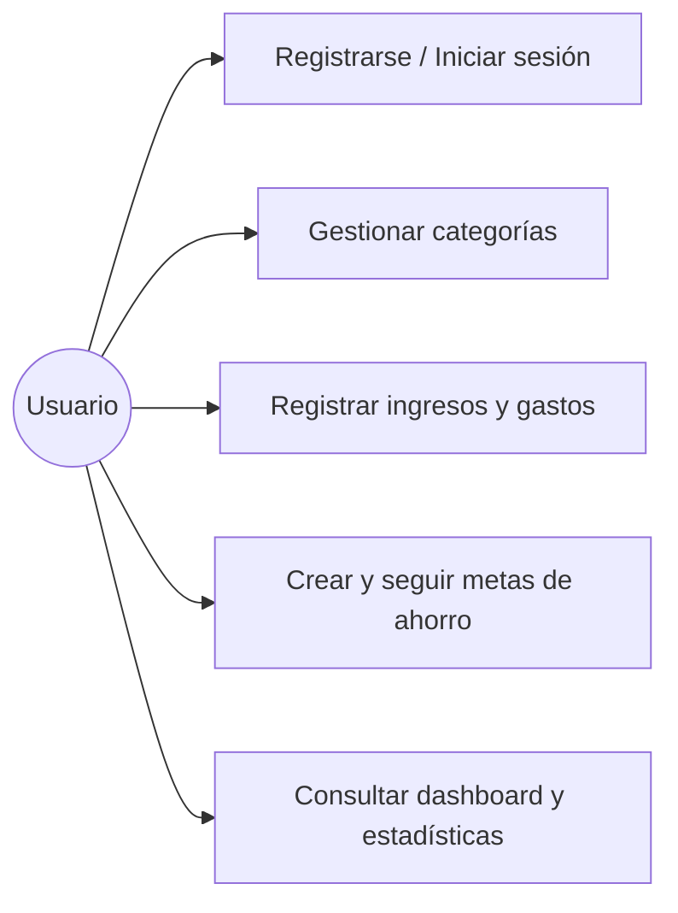

### Usuario

| Acción | Descripción |
|--------|------------|
| Registrarse | Crear cuenta con email y contraseña |
| Iniciar sesión | Autenticarse via Supabase Auth |
| Gestionar categorías | CRUD de categorías de ingreso/gasto |
| Registrar movimientos | Crear, editar, eliminar ingresos y gastos |
| Metas de ahorro | Crear metas con fecha límite y monitorear progreso |
| Dashboard | Visualizar balance, gráficos y resúmenes |

---

## 5. Módulos del Sistema

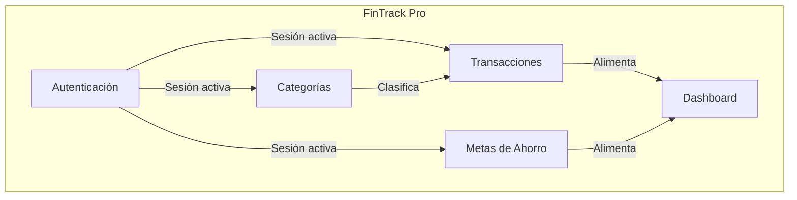

### Autenticación
- Registro con email y contraseña
- Inicio de sesión (Supabase Auth)
- Cierre de sesión
- Protección de rutas (middleware)

### Categorías
- Crear categoría (nombre, tipo: ingreso/gasto, icono)
- Editar categoría
- Eliminar categoría
- Listar categorías del usuario
- Categorías predeterminadas al registrarse

### Transacciones
- Registrar ingreso o gasto
- Asignar categoría y descripción
- Editar movimiento
- Eliminar movimiento
- Consultar historial con filtros (fecha, tipo, categoría)
- Paginación del historial

### Metas de Ahorro
- Crear meta (título, monto objetivo, fecha límite)
- Consultar progreso (porcentaje completado)
- Editar meta
- Eliminar meta

### Dashboard
- Balance actual (ingresos - gastos)
- Total de ingresos acumulados
- Total de gastos acumulados
- Distribución de gastos por categoría (gráfico de dona)
- Tendencia mensual de ingresos vs gastos (gráfico de barras)
- Últimos movimientos recientes
- Avance de metas de ahorro (barras de progreso)

---

## 6. Arquitectura General

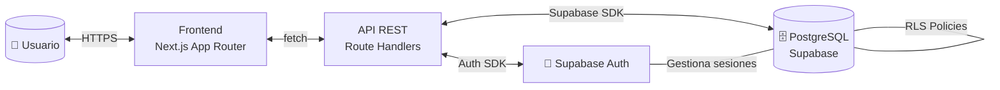

### Flujo de datos

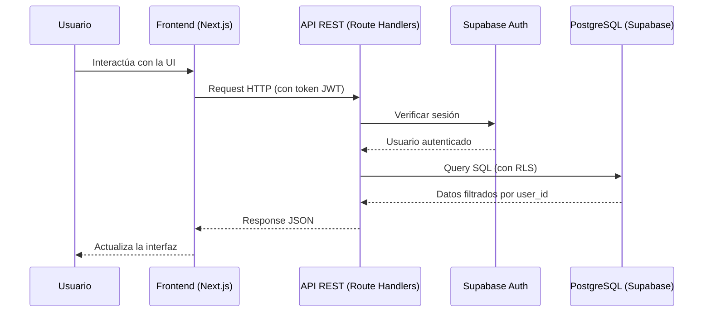

---

## 7. Flujos del Sistema

### 7.1 Registro de Usuario

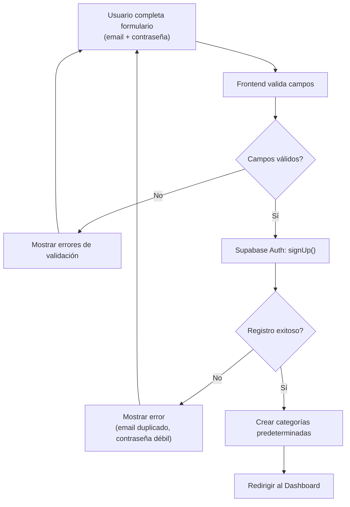

### 7.2 Inicio de Sesión

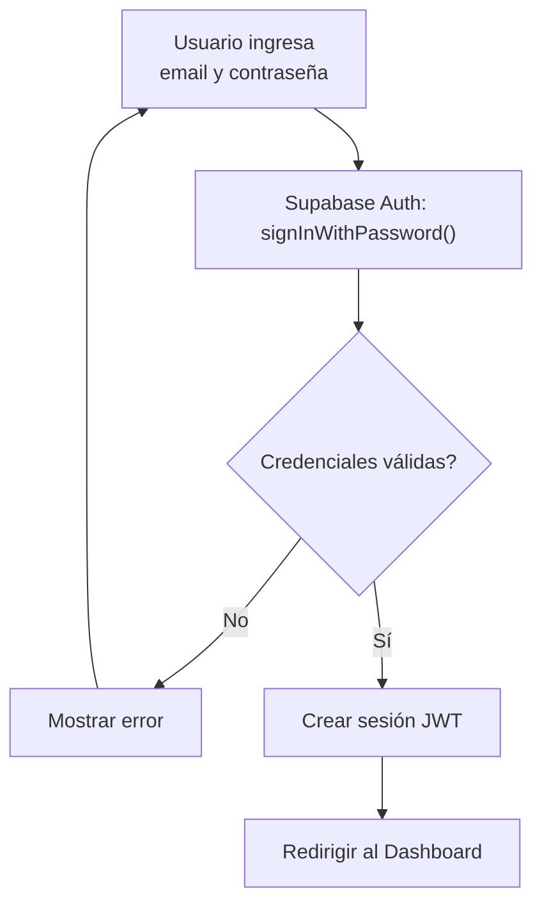

### 7.3 Registro de Transacción

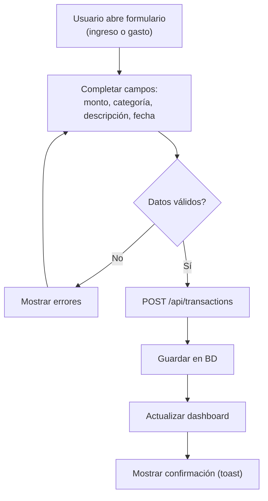

### 7.4 Gestión de Metas

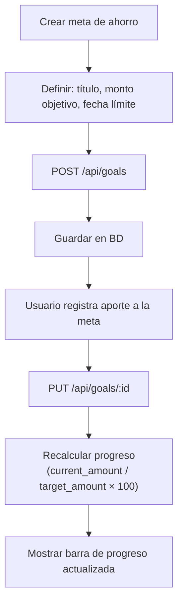

---

## 8. Modelo de Datos

### Diagrama Entidad-Relación

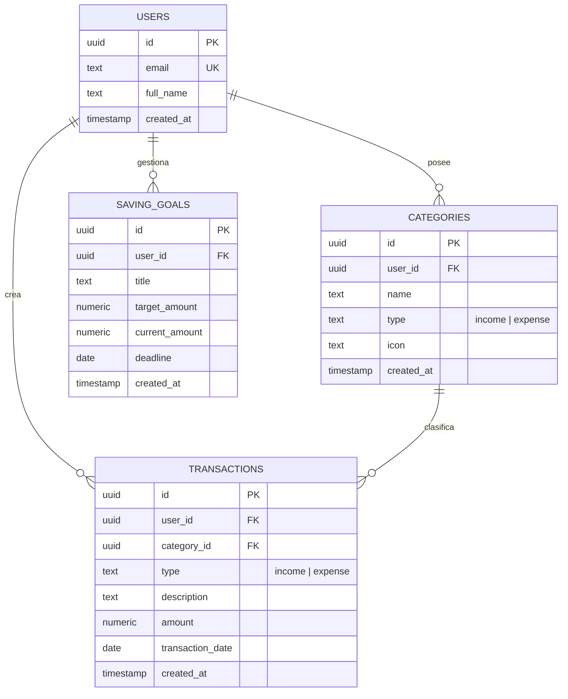

### Detalle de Tablas

#### `profiles` (extiende auth.users de Supabase)

| Campo | Tipo | Restricción | Descripción |
|-------|------|-------------|-------------|
| id | UUID | PK, FK → auth.users | ID del usuario |
| email | TEXT | NOT NULL, UNIQUE | Correo electrónico |
| full_name | TEXT | | Nombre completo |
| created_at | TIMESTAMPTZ | DEFAULT now() | Fecha de creación |

#### `categories`

| Campo | Tipo | Restricción | Descripción |
|-------|------|-------------|-------------|
| id | UUID | PK, DEFAULT gen_random_uuid() | Identificador |
| user_id | UUID | FK → profiles.id, NOT NULL | Dueño |
| name | TEXT | NOT NULL | Nombre de la categoría |
| type | TEXT | NOT NULL, CHECK (income/expense) | Tipo |
| icon | TEXT | DEFAULT '📁' | Emoji o icono |
| created_at | TIMESTAMPTZ | DEFAULT now() | Fecha de creación |

#### `transactions`

| Campo | Tipo | Restricción | Descripción |
|-------|------|-------------|-------------|
| id | UUID | PK, DEFAULT gen_random_uuid() | Identificador |
| user_id | UUID | FK → profiles.id, NOT NULL | Dueño |
| category_id | UUID | FK → categories.id, NOT NULL | Categoría asignada |
| type | TEXT | NOT NULL, CHECK (income/expense) | Ingreso o gasto |
| description | TEXT | | Descripción opcional |
| amount | NUMERIC(12,2) | NOT NULL, CHECK (> 0) | Monto siempre positivo |
| transaction_date | DATE | NOT NULL, DEFAULT CURRENT_DATE | Fecha del movimiento |
| created_at | TIMESTAMPTZ | DEFAULT now() | Fecha de registro |

#### `saving_goals`

| Campo | Tipo | Restricción | Descripción |
|-------|------|-------------|-------------|
| id | UUID | PK, DEFAULT gen_random_uuid() | Identificador |
| user_id | UUID | FK → profiles.id, NOT NULL | Dueño |
| title | TEXT | NOT NULL | Nombre de la meta |
| target_amount | NUMERIC(12,2) | NOT NULL, CHECK (> 0) | Monto objetivo |
| current_amount | NUMERIC(12,2) | DEFAULT 0, CHECK (>= 0) | Monto acumulado |
| deadline | DATE | | Fecha límite opcional |
| created_at | TIMESTAMPTZ | DEFAULT now() | Fecha de creación |

### Seguridad: Row Level Security (RLS)

Todas las tablas tendrán RLS habilitado. Cada política garantiza que un usuario solo acceda a sus propios registros:

```sql
-- Ejemplo para transactions
ALTER TABLE transactions ENABLE ROW LEVEL SECURITY;

CREATE POLICY "Users can view own transactions"
  ON transactions FOR SELECT
  USING (auth.uid() = user_id);

CREATE POLICY "Users can insert own transactions"
  ON transactions FOR INSERT
  WITH CHECK (auth.uid() = user_id);

CREATE POLICY "Users can update own transactions"
  ON transactions FOR UPDATE
  USING (auth.uid() = user_id);

CREATE POLICY "Users can delete own transactions"
  ON transactions FOR DELETE
  USING (auth.uid() = user_id);
```

---

## 9. API REST

### Endpoints

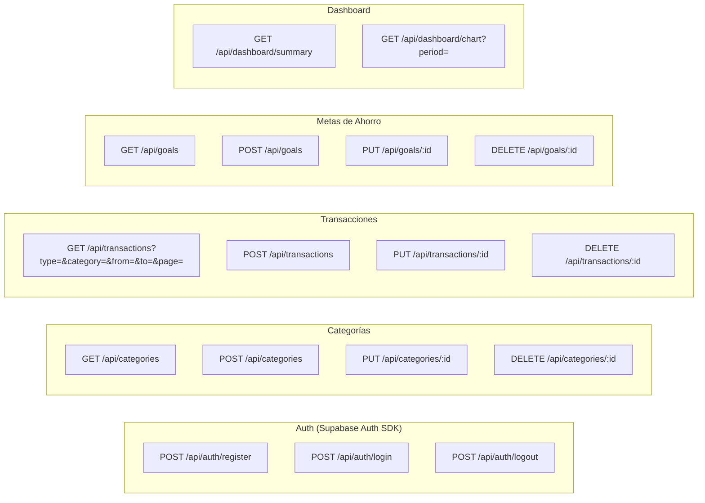

### Detalle de Endpoints

| Método | Endpoint | Descripción | Query Params |
|--------|----------|-------------|-------------|
| POST | `/api/auth/register` | Registrar usuario | — |
| POST | `/api/auth/login` | Iniciar sesión | — |
| POST | `/api/auth/logout` | Cerrar sesión | — |
| GET | `/api/categories` | Listar categorías del usuario | `?type=income\|expense` |
| POST | `/api/categories` | Crear categoría | — |
| PUT | `/api/categories/:id` | Editar categoría | — |
| DELETE | `/api/categories/:id` | Eliminar categoría | — |
| GET | `/api/transactions` | Listar transacciones | `?type=&category_id=&from=&to=&page=&limit=` |
| POST | `/api/transactions` | Crear transacción | — |
| PUT | `/api/transactions/:id` | Editar transacción | — |
| DELETE | `/api/transactions/:id` | Eliminar transacción | — |
| GET | `/api/goals` | Listar metas de ahorro | — |
| POST | `/api/goals` | Crear meta | — |
| PUT | `/api/goals/:id` | Editar meta / agregar aporte | — |
| DELETE | `/api/goals/:id` | Eliminar meta | — |
| GET | `/api/dashboard/summary` | Balance, totales, últimos movimientos | — |
| GET | `/api/dashboard/chart` | Datos para gráficos | `?period=month\|year` |

### Formato de Respuesta Estándar

```json
{
  "success": true,
  "data": { },
  "error": null,
  "pagination": {
    "page": 1,
    "limit": 10,
    "total": 50,
    "totalPages": 5
  }
}
```

---

## 10. Dashboard — Componentes Visuales

| Componente | Tipo de Gráfico | Datos |
|------------|----------------|-------|
| Balance Total | Tarjeta KPI | ingresos - gastos |
| Total Ingresos | Tarjeta KPI | Suma de ingresos |
| Total Gastos | Tarjeta KPI | Suma de gastos |
| Gastos por Categoría | Gráfico de Dona | % por categoría |
| Tendencia Mensual | Gráfico de Barras | Ingresos vs Gastos por mes |
| Últimos Movimientos | Tabla / Lista | 5–10 transacciones recientes |
| Metas de Ahorro | Barras de Progreso | current_amount / target_amount |

---

## 11. Estructura del Proyecto

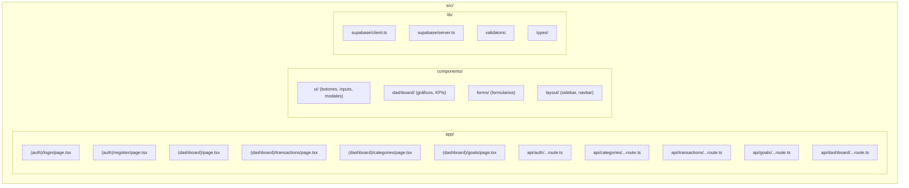

---

## 12. Categorías Predeterminadas

Al registrarse, se crean automáticamente:

### Ingresos
| Categoría | Icono |
|-----------|-------|
| Salario | 💰 |
| Freelance | 💻 |
| Inversiones | 📈 |
| Otros Ingresos | 💵 |

### Gastos
| Categoría | Icono |
|-----------|-------|
| Alimentación | 🍕 |
| Transporte | 🚗 |
| Vivienda | 🏠 |
| Entretenimiento | 🎮 |
| Salud | ⚕️ |
| Educación | 📚 |
| Servicios | 💡 |
| Otros Gastos | 📦 |

---

## 13. Reglas de Validación

| Campo | Regla |
|-------|-------|
| email | Formato válido, único |
| password | Mínimo 6 caracteres |
| category.name | No vacío, máx 50 caracteres |
| category.type | Solo "income" o "expense" |
| transaction.amount | Número positivo > 0 |
| transaction.type | Solo "income" o "expense" |
| transaction.category_id | Debe existir y pertenecer al usuario |
| transaction.transaction_date | Fecha válida, no futura |
| goal.title | No vacío, máx 100 caracteres |
| goal.target_amount | Número positivo > 0 |
| goal.current_amount | >= 0, <= target_amount |

---

## 14. Skills del Ecosistema a Utilizar

Skills recomendadas para guiar el desarrollo con mejores prácticas:

### Alta Prioridad (fuentes oficiales)

| Skill | Fuente | Installs | Uso |
|-------|--------|----------|-----|
| supabase-postgres-best-practices | `supabase/agent-skills` | 233.7K | Esquema, RLS, queries |
| supabase | `supabase/agent-skills` | 123.9K | Integración general |
| next-best-practices | `vercel-labs/next-skills` | 106.3K | App Router, RSC, SSR |
| vercel-react-best-practices | `vercel-labs/agent-skills` | 478.9K | Componentes React |
| web-design-guidelines | `vercel-labs/agent-skills` | 393.3K | Diseño web profesional |

### Media Prioridad

| Skill | Fuente | Installs | Uso |
|-------|--------|----------|-----|
| nextjs-supabase-auth | `sickn33/antigravity-awesome-skills` | 5.4K | Auth con Next.js + Supabase |
| frontend-design | `anthropics/skills` | 549.5K | Diseño frontend |
| tailwindcss | `hairyf/skills` | 2.2K | Buenas prácticas TailwindCSS |

### Comandos de instalación

```bash
npx.cmd skills add supabase/agent-skills --skill supabase-postgres-best-practices
npx.cmd skills add supabase/agent-skills --skill supabase
npx.cmd skills add vercel-labs/next-skills --skill next-best-practices
npx.cmd skills add vercel-labs/agent-skills --skill vercel-react-best-practices
npx.cmd skills add vercel-labs/agent-skills --skill web-design-guidelines
```

---

## 15. Fases de Implementación

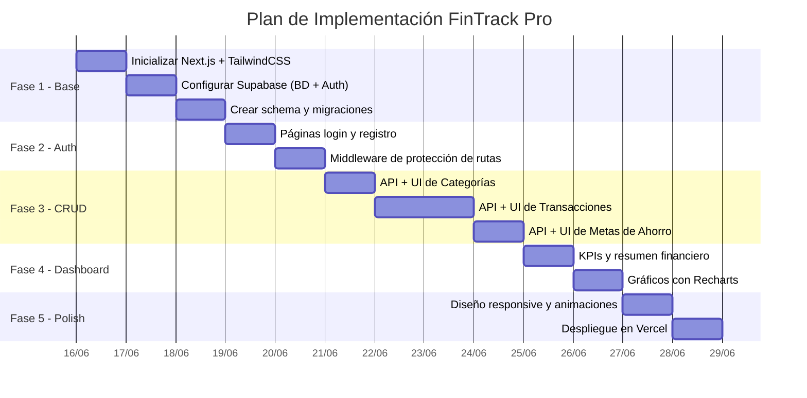

| Fase | Descripción | Entregables |
|------|------------|-------------|
| 1 - Base | Setup del proyecto y base de datos | Proyecto Next.js, schema SQL, conexión Supabase |
| 2 - Auth | Autenticación completa | Login, registro, logout, middleware, RLS |
| 3 - CRUD | Funcionalidades principales | CRUD categorías, transacciones, metas |
| 4 - Dashboard | Visualización de datos | KPIs, gráficos, tabla de movimientos |
| 5 - Polish | Pulido y despliegue | Responsive, animaciones, deploy Vercel |

---

## 16. Funcionalidades Mínimas (MVP)

- [x] Registro e inicio de sesión con Supabase Auth
- [ ] CRUD completo de categorías (con tipo e icono)
- [ ] CRUD completo de transacciones (con filtros y paginación)
- [ ] CRUD completo de metas de ahorro (con progreso)
- [ ] Dashboard financiero con gráficos interactivos
- [ ] Consumo de API REST con validación
- [ ] Persistencia en PostgreSQL con RLS
- [ ] Despliegue en Vercel

---

## 17. Posibles Mejoras Futuras

- Exportación a PDF
- Exportación a Excel
- Recordatorios financieros
- Presupuesto mensual con alertas
- Predicción de gastos usando IA
- Recomendaciones automáticas de ahorro
- Modo oscuro / claro con selector
- Multi-moneda

---

## 18. Preguntas Pendientes

> **Estas preguntas deben responderse antes de comenzar la implementación:**

1. **Autenticación**: ¿Solo email/contraseña o también Google OAuth?
2. **Proyecto Supabase**: ¿Usar proyecto existente (Moviles/Banco app) o crear uno nuevo?
3. **Moneda**: ¿Una sola moneda? ¿Cuál? (USD, MXN, COP, EUR...)
4. **Idioma de la UI**: ¿Español o inglés?
5. **Tema visual**: ¿Dark mode, light mode, o ambos?
6. **TailwindCSS**: ¿Versión 3 o 4?
7. **¿Instalar las skills recomendadas** de la sección 14?
8. **Alcance**: ¿Solo MVP (sección 16) o incluir alguna mejora futura?
