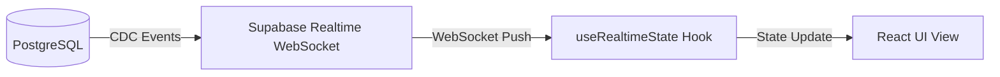

# FinTrack Pro
### Arquitectura Cliente-Servidor Reactiva en Tiempo Real

Presentado por el equipo de ingeniería de software

<div class="pt-12">
  <span @click="$slidev.nav.next" class="px-6 py-3 rounded-xl bg-blue-600 hover:bg-blue-700 text-white font-bold cursor-pointer transition-all shadow-lg hover:shadow-blue-500/20">
    Comenzar Presentación
  </span>
</div>

---
transition: fade-out
---

# 1. Vista General de la Arquitectura

Una plataforma de finanzas personales requiere consistencia de datos, baja latencia y alta seguridad.

<br>

* **Capa de Cliente (Frontend)**
  * Next.js 16 (React 19) App Router
  * Interfaz fluida con Tailwind CSS v4 y componentes accesibles (Radix / Shadcn).

* **Capa de Servicios y BFF (Backend-for-Frontend)**
  * Next.js Route Handlers para lógica intermedia segura de escritura.
  * Tareas programadas (*Cron jobs*) para actualización automática de tipos de cambio de divisas.

* **Capa de Persistencia y Reglas de Negocio (Base de Datos)**
  * PostgreSQL en Supabase.
  * Lógica delegada al motor mediante triggers (conversión de divisas y cálculo de presupuestos).

---

# 2. Flujo Reactivo en Tiempo Real

Conexión continua y actualización automática del cliente sin necesidad de recargar.

<br>



<br>

* **CDC (Change Data Capture)**: Cada inserción o actualización en la base de datos es capturada y expuesta como un evento en tiempo real.
* **WebSocket Channel**: El cliente abre un único canal de comunicación bidireccional y persistente.
* **Actualizaciones Fluida**: Al recibir un evento, el hook actualiza el estado y redibuja la UI con micro-animaciones dinámicas.

---

# 3. Persistencia y Seguridad (RLS)

Aislamiento absoluto de datos garantizado directamente por el motor de base de datos.

<br>

* **Row Level Security (RLS)**
  * Todas las tablas tienen políticas RLS activas por defecto.
  * La consulta es validada directamente en PostgreSQL contra la identidad de autenticación:
    ```sql
    CREATE POLICY "Transactions - Select" 
    ON public.transactions 
    FOR SELECT 
    USING (auth.uid() = user_id);
    ```

* **Beneficios de Seguridad**
  * La protección de los datos financieros no depende únicamente del frontend.
  * Si la capa del cliente presenta vulnerabilidades, la base de datos bloquea el acceso no autorizado de forma nativa.

---

# 4. Reglas de Negocio en PostgreSQL (Triggers)

Cómputos atómicos ejecutados antes y después de guardar datos.

<br>

* **Conversión Multidivisa Automatizada (`BEFORE INSERT OR UPDATE`)**
  * Intercepta la transacción antes de ser guardada.
  * Consulta el tipo de cambio respectivo en `exchange_rates` y guarda el valor normalizado en la divisa base del usuario.

* **Monitoreo de Presupuestos (`AFTER INSERT OR UPDATE`)**
  * Suma los gastos totales del mes para la categoría seleccionada.
  * Si excede el 90% o el 100% del presupuesto mensual configurado, escribe una alerta en `budget_alerts` de forma automática.

---

# 5. Ciclo de Vida de un Registro

¿Cómo viaja la información al ingresar un nuevo gasto?

<br>

1. **Entrada de Datos**: El usuario registra un gasto de **$100.000 COP** en la interfaz.
2. **Next.js BFF (API)**: El frontend envía la transacción a `/api/transactions`. El Route Handler valida la sesión del usuario.
3. **Escritura y Trigger**: PostgreSQL escribe el registro. El trigger convierte los COP a la moneda base del usuario (ej. USD) y valida el límite presupuestario.
4. **Alerta**: Si se excede el presupuesto, se escribe la alerta.
5. **Reacción**: Supabase propaga la nueva transacción y alerta por WebSocket.
6. **Animación en UI**: El hook del cliente recibe la actualización, y la interfaz renderiza el cambio con transiciones suaves.

---

# 6. Ecosistema de Librerías

Herramientas clave utilizadas para potenciar la funcionalidad y la estética.

<br>

* **Animación e Interactividad**
  * `gsap` y `@gsap/react`: Animación de contadores de balance financiero y barras de progreso.
  * `blendy`: Transición de layouts complejos entre estados de la interfaz.
  * `three`: Renderizado e interacción con elementos tridimensionales.
* **Visualización de Datos**
  * `recharts` y `d3`: Gráficos interactivos de flujos, distribución de gastos y metas.
* **Generación de Reportes**
  * `jspdf` y `jspdf-autotable`: Exportación del estado de cuenta consolidado en PDF.
  * `xlsx` (SheetJS): Descarga estructurada del listado de transacciones a Excel.
* **UI & Componentes**
  * `radix-ui` / `shadcn` / `tailwind-merge`: Primitivas de interfaz accesibles y consistentes.

---
layout: center
class: text-center
---

# Conclusión

### Una arquitectura moderna para aplicaciones financieras

<br>

**Seguridad Robusta (RLS)** | **Reactividad Inmediata (CDC)** | **Integridad de Datos (Triggers)**

<br>
<br>

¿Tienen alguna pregunta?
